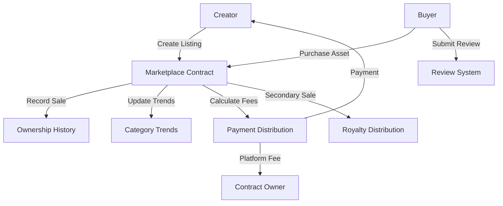

# Orchestrated Ink Optimizer

An intelligent decentralized marketplace for digital asset trading and optimization on the Stacks blockchain, empowering creators with advanced trading mechanics and trend insights.

## Overview

Orchestrated Ink Optimizer is a sophisticated marketplace built on the Stacks blockchain that enables creators to:
- List and tokenize digital creative assets
- Implement dynamic pricing and royalty strategies
- Gain actionable market trend intelligence
- Establish credibility through transparent review mechanisms
- Secure asset ownership transfers using STX tokens

Key features:
- Customizable pricing and royalty structures
- Trend tracking and analytics
- Reputation and review system
- Secure ownership transfer
- Secondary market support

## Architecture

The marketplace is built around a single core smart contract that handles all marketplace operations:



### Core Components:
1. **Listing Management**: Creation, updating, and removal of asset listings
2. **Purchase System**: Secure buying process with automatic fee distribution
3. **Ownership Tracking**: Historical record of asset ownership
4. **Review System**: Buyer feedback and rating mechanism
5. **Trend Analysis**: Purchase tracking by category and time period

## Contract Documentation

### Design Asset Optimizer Contract

The main contract (`design-asset-optimizer.clar`) provides comprehensive marketplace optimization mechanisms.

#### Key Features

- **Intelligent Listing Management**
  - Dynamic listing creation and modification
  - Flexible pricing and royalty configurations
  - Rich asset metadata storage and retrieval

- **Purchase Processing**
  - Handle secure transactions
  - Distribute platform fees
  - Record ownership changes
  - Update trend data

- **Review System**
  - Submit and store reviews
  - Track review status
  - Limit one review per purchase

#### Access Control
- Only listing creators can modify their listings
- Only buyers can submit reviews for purchased assets
- Platform fees are sent to the contract owner
- Maximum royalty percentage is capped at 15%

## Getting Started

### Prerequisites
- Clarinet
- Stacks wallet
- STX tokens for transactions

### Basic Usage

1. **Creating a Listing**
```clarity
(contract-call? .design-asset-optimizer create-listing 
    "Digital Design Masterpiece"
    "A cutting-edge professional design template"
    u1000000 ;; Price in µSTX
    "innovative-templates"
    "https://preview.example.com"
    "https://full-asset.example.com"
    u10 ;; 10% royalty
)
```

2. **Purchasing an Asset**
```clarity
(contract-call? .design-asset-optimizer purchase-asset u1)
```

3. **Submitting a Review**
```clarity
(contract-call? .design-asset-optimizer submit-review 
    u1 ;; listing-id
    u5 ;; score
    "Exceptional quality and design!"
)
```

## Function Reference

### Public Functions

#### Listing Management
```clarity
(create-listing (title (string-ascii 100)) 
                (description (string-utf8 500)) 
                (price uint) 
                (category (string-ascii 50))
                (preview-url (string-utf8 200))
                (full-asset-url (string-utf8 200))
                (royalty-percent uint))

(update-listing (listing-id uint) ...)
(remove-listing (listing-id uint))
```

#### Transaction Functions
```clarity
(purchase-asset (listing-id uint))
(resell-asset (listing-id uint) (new-price uint))
```

#### Review System
```clarity
(submit-review (listing-id uint) (score uint) (comment (string-utf8 300)))
```

### Read-Only Functions
```clarity
(get-listing (listing-id uint))
(has-purchased (listing-id uint) (user principal))
(get-review (listing-id uint) (reviewer principal))
(get-category-trend (category (string-ascii 50)) (month-year (string-ascii 7)))
(get-ownership-history (listing-id uint) (index uint))
```

## Development

### Testing
1. Install Clarinet
2. Clone the repository
3. Run tests:
```bash
clarinet test
```

### Local Development
1. Start Clarinet console:
```bash
clarinet console
```
2. Deploy contract:
```clarity
(contract-call? .trendcraft-marketplace ...)
```

## Security Considerations

### Limitations
- Asset URLs are stored on-chain as strings
- Trend analysis is based on block height for time approximation
- Review scores are limited to 0-5 range

### Best Practices
- Verify asset ownership before reselling
- Check listing status before purchasing
- Keep sufficient STX for platform fees
- Review asset details and seller reputation before purchasing
- Ensure listing prices are set in µSTX (multiply by 1,000,000)